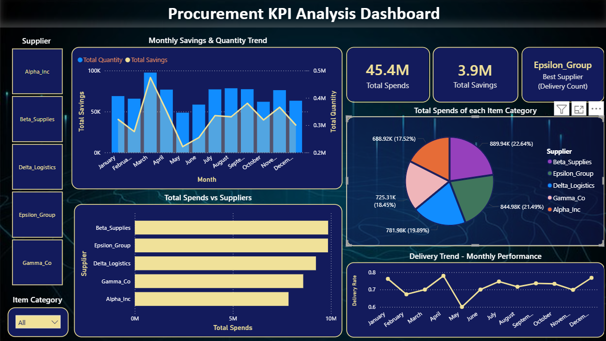

# Procurement KPI Analysis - Power BI Dashboard
Interactive Power BI dashboard analyzing procurement KPIs — including spend, savings and delivery trends — to visualize supplier performance and monthly insights.

# Overview
•	This dashboard provides insights into procurement performance, helping identify cost-saving opportunities and supplier efficiency.  
•	It visualizes key KPIs such as Total Spend, Total Savings, Supplier Performance and Delivery Trends.

# Key Insights
•	Monthly Savings & Quantity Trend – Tracks monthly savings and procurement quantities to highlight seasonal patterns.  
•	Total Spends vs Suppliers – Compares supplier-wise spending to identify top contributors.  
•	Item Category Spend Distribution – Shows how procurement costs are distributed across categories.  
•	Delivery Trend Performance – Evaluates supplier delivery reliability month-to-month.  
•	Best Supplier: Epsilon Group (highest delivery count).

# Tools Used
•	**Power BI** – Data visualization and KPI dashboard design  
•	**Excel** – Data cleaning and preparation  
•	**DAX** – Custom measures and calculations for dynamic insights  

# Dataset Source
Procurement dataset obtained from **Kaggle**, containing supplier details, item categories, order status, quantity and pricing and delivery performance metrics.  

# Business Impact
This dashboard enables procurement teams to:
•	Monitor supplier performance and delivery efficiency  
•	Identify cost-saving trends  
•	Support data-driven decision-making for strategic sourcing  

## Preview

